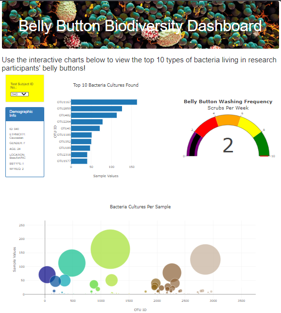

# Belly_button_Biodiversity

The purpose of this project was to visualize bacterial data collected from the navels of volunteer participants. If Improbable Beef, a synthetic beef manufacturing company, identifies a species of bacteria to use in their product, volunteers would be able to interact with the webpage in order to tell if they are candidates. 

This data is visualized in three charts: bar, bubble, and gauge. The user will select a participant ID from a dropdown, and the charts will showcase that participant's data on each plot. The user can hover over the plot elements to see details. 

Link to project webpage [here](https://k8rly.github.io/Belly_button_Biodiversity/).

